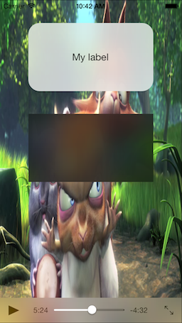

# LiveBlur Module

## Description

#### This module is a view with the real time blur effect. Compatible only with iOS 7.


##### View with blue on top of movie to see in real time.


Apple on iOS 7 put some screens on the system with the blur effect like Control or Notification Center. It's a nice effect and many people want to do the same in their applications, and has asked to Appcelerator, which put this feature in titanium.

The Appcelerator does not and can not help much with this feature, for the simple reason of Apple use a custom, private API for this that we don't have access to.

Many modules are to capture the screen, apply the effect on the image and display it, but it is very expensive for the hardware and does not give the effect in real time. 

If we use a private API, the application will never be approved by Apple.

But Apple gave a component that can be used and makes this end, the **UIToolbar**.

Is it an elegant and clean solution? Certainly not, UIToolbar should only be used as a toolbar. But if you really want a realtime blurred UIView it may just be the only way to go as long as Apple does not provide this API. Will it be rejected? No.


### Get the module

**You can download the version already compiled on dist folder**


## Accessing the LiveBlur Module

To access this module from JavaScript, you would do the following:

```javascript
var blur = require("com.widbook.blur");
```

The blur variable is a reference to the Module object.

## Functions

### createView

Simple, create a view with (almost) all the properties of the native view of Titanium. Just do not have the 'backgroundColor' properties and 'backgroundImage'.

```javascript
var myView = blur.createView();
```

## Properties

This view has its own properties


### translucentStyleLight

*Boolean*, **true** (default) for Light color and **false** for Dark

```javascript
var myView = blur.createView({
	translucentStyleLight:false
});
```

or

```javascript
myView.translucentStyleLight = false;
```

### translucentColor

*Color*, if you need colorize, use color with alpha values

```javascript

var myColor = '#66FF0000' // Red with alpha channel -- '#' + 2 digits hex alpha + 6 digits hex color

var myView = blur.createView({
	translucentColor:myColor
});
```

or

```javascript
var myColor = '#6600FF00' // Green with alpha channel -- '#' + 2 digits hex alpha + 6 digits hex color
myView.translucentColor = myColor;
```


## This is a module that I'm still working to improve it


##### Based on [https://github.com/ivoleko/ILTranslucentView](https://github.com/ivoleko/ILTranslucentView)

## Author

Adriano Paladini
